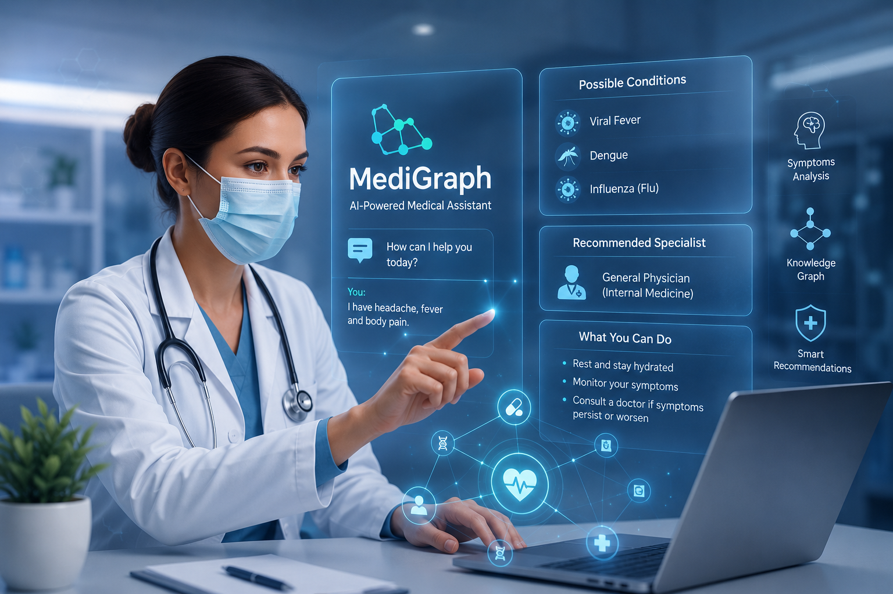

# MediGraph

**MediGraph** is a conversational medical assistant that leverages Large Language Models and a Neo4j knowledge graph to help users better understand their symptoms. Users can describe their symptoms in natural language, and the system analyzes the information to identify possible related medical conditions, explain those conditions, provide educational guidance, and recommend the most appropriate healthcare specialist to consult.

Rather than replacing healthcare professionals, MediGraph acts as a **preliminary clinical decision-support assistant**, helping users become more informed before seeking medical attention.

> **Disclaimer:** MediGraph is intended for educational purposes only. It is **not** a substitute for professional medical diagnosis, treatment, or clinical advice.

---

# 🚀 Features

* 💬 Natural language symptom conversations
* 🧠 Neo4j knowledge graph for structured medical reasoning
* 🔍 Identification of possible conditions based on symptoms
* 📖 Educational explanations of diseases
* 🩺 Doctor and specialist recommendations
* 📌 Guidance on possible next steps
* ⚡ Interactive conversational interface

---

# 💡 Problem Statement

Many people experience symptoms but are uncertain about their possible causes or which healthcare professional they should consult. General internet searches often return inconsistent or unreliable information, while scheduling a doctor's appointment for every minor concern may not always be practical.

The goal of MediGraph is to provide an intelligent first layer of health guidance that helps users understand possible medical conditions based on their symptoms while encouraging consultation with qualified healthcare professionals whenever necessary.

---

# ✅ Solution

MediGraph combines conversational AI with a medical knowledge graph to provide structured and context-aware responses.

Users simply describe their symptoms, and the system:

* Understands the symptom description using natural language processing.
* Traverses a Neo4j knowledge graph to explore relationships between symptoms, diseases, and healthcare specialties.
* Identifies possible medical conditions that may be associated with the reported symptoms.
* Explains each condition in simple language.
* Provides general information about causes, symptoms, diagnosis, treatment approaches, and preventive measures.
* Suggests the type of doctor or medical specialist that may be appropriate to consult.

The system is designed to support healthcare awareness rather than replace clinical judgment.

---

# 🛠️ Technology Stack

### Backend

* Python
* Django

### AI

* OpenAI
* Prompt Engineering
* Conversational AI

### Knowledge Graph

* Neo4j
* Cypher

### Database

* SQLite

---

# 📊 Example Use Cases

* Symptom exploration
* Health education
* Preliminary healthcare guidance
* Doctor recommendation
* Medical knowledge discovery

---

# 🎯 Benefits

* Interactive healthcare assistant
* Structured reasoning through Neo4j
* Context-aware responses
* Easy-to-understand medical explanations
* Supports informed healthcare decisions
* Encourages early medical consultation when appropriate

---

# ⚠️ Limitations

MediGraph is **not designed to diagnose diseases**.

Possible medical conditions generated by the system should be treated as **informational hypotheses**, not confirmed diagnoses.

Because conversational AI can occasionally generate inaccurate or incomplete responses (hallucinations), users should always verify important medical information with qualified healthcare professionals.

---

# 🔮 Future Enhancements

* GraphRAG integration
* Medical literature retrieval
* Voice-based interaction
* Multilingual support
* Electronic Health Record integration
* Personalized health profiles
* Confidence scoring for possible conditions

---

# 📄 Project Overview

MediGraph demonstrates how conversational AI and graph databases can be combined to build an intelligent healthcare assistant. By leveraging a Neo4j knowledge graph and natural language interaction, the platform helps users explore possible medical conditions, understand related healthcare information, and identify appropriate specialists while maintaining a responsible AI-first approach.

---

## 👨‍💻 Author

**Sumair Rasi**

Machine Learning Engineer | NLP | Generative AI | MLOps
